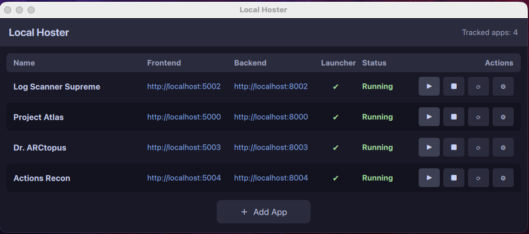

# Local Hoster

A lightweight desktop app to track, launch, and restart locally hosted web applications.



## Features

- **Track** all your local web apps in one place (name, frontend URL, backend URL)
- **Start / Stop / Restart** apps with one click via their `launcher.sh` or `launcher.py`
- **Auto-detect** launcher scripts in each project folder (checks for both `launcher.sh` and `launcher.py`)
- **Port-aware launching** - automatically extracts ports from the configured frontend/backend URLs and passes them as `-p` (frontend) and `-b` (backend) arguments to the launcher
- **Auto-detect running apps** - checks if configured ports are already in use and marks apps as running on startup (polls every 5 seconds)
- **Kill by port** - can stop apps that were started outside of Local Hoster by finding and killing processes on their configured ports
- **Persist** configuration across launches via `config.json`
- **Add / Edit / Remove** apps through a built-in dialog with a folder browser
- **GitHub repo** link stored alongside each project
- Cross-platform: Windows and macOS

## Tech Stack

| Layer    | Technology          |
|----------|---------------------|
| Frontend | QML (Qt Quick)      |
| Backend  | Python + PySide6    |
| Config   | JSON (`config.json`)|

## Project Structure

```
local-hoster/
├── launcher.py          # Creates venv, installs deps, launches the app
├── requirements.txt     # PySide6
├── config.json          # Persisted app list (auto-managed)
├── README.md
└── src/
    ├── main.py          # Application entry point
    ├── app_manager.py   # Backend model & process management
    └── qml/
        ├── Main.qml         # Main window with app list
        └── AddAppDialog.qml # Add / Edit dialog
```

## Getting Started

**Requires Python 3.10+**

### Quick Start (recommended)

```bash
python launcher.py
```

This will:
1. Create a virtual environment in `./venv`
2. Install PySide6 from `requirements.txt`
3. Launch the application

### Manual Setup

```bash
python -m venv venv
# Windows:
venv\Scripts\activate
# macOS/Linux:
source venv/bin/activate

pip install -r requirements.txt
python src/main.py
```

## How It Works

Each tracked web app must have a **launcher script** in its project folder. Local Hoster looks for both filenames on all platforms and uses the first one found:

| Priority | Script         |
|----------|----------------|
| 1        | `launcher.sh`  |
| 2        | `launcher.py`  |

### Launcher Script Requirements

Your launcher script **must accept** the following command-line arguments:

| Flag | Description           | Example |
|------|-----------------------|---------|
| `-p` | Frontend port number  | `5001`  |
| `-b` | Backend port number   | `8001`  |

Local Hoster extracts the port numbers from the frontend and backend URLs you configure for each app, then passes them when starting the launcher:

```bash
# Example: app configured with frontend http://localhost:5001 and backend http://localhost:8001
bash launcher.sh -p 5001 -b 8001
# or
python launcher.py -p 5001 -b 8001
```

If no backend URL is configured, only `-p` is passed. If no frontend URL port is detectable, no port flags are passed.

### Running Detection

Local Hoster checks whether each app's configured ports are in use on localhost. This happens:
- On startup (so previously running apps show as active)
- Every 5 seconds via background polling

When you click **Stop** on an app that was already running before Local Hoster started, it will find and kill the processes bound to those ports using `lsof` (macOS/Linux) or `netstat`/`taskkill` (Windows).

## Making Your App Compatible with Local Hoster

### Option 1: Shell script (`launcher.sh`)

Create a `launcher.sh` in your project root:

```bash
#!/bin/bash
# launcher.sh - Start the app with configurable ports

# Default ports
FRONTEND_PORT=3000
BACKEND_PORT=8000

# Parse arguments from Local Hoster
while getopts "p:b:" opt; do
    case $opt in
        p) FRONTEND_PORT="$OPTARG" ;;
        b) BACKEND_PORT="$OPTARG" ;;
    esac
done

# Activate venv if present
if [ -d "venv" ]; then
    source venv/bin/activate
fi

# Start your backend (example: Flask)
python app.py --port "$BACKEND_PORT" &

# Start your frontend (example: Vite/React)
cd frontend && npm run dev -- --port "$FRONTEND_PORT" &

# Wait for all background processes
wait
```

Make it executable: `chmod +x launcher.sh`

### Option 2: Python script (`launcher.py`)

Create a `launcher.py` in your project root:

```python
#!/usr/bin/env python3
"""launcher.py - Start the app with configurable ports."""

import argparse
import subprocess
import sys
import os

def main():
    parser = argparse.ArgumentParser()
    parser.add_argument("-p", "--frontend-port", type=int, default=3000)
    parser.add_argument("-b", "--backend-port", type=int, default=8000)
    args = parser.parse_args()

    # Start your backend
    backend = subprocess.Popen(
        [sys.executable, "app.py", "--port", str(args.backend_port)]
    )

    # Start your frontend
    frontend = subprocess.Popen(
        ["npm", "run", "dev", "--", "--port", str(args.frontend_port)],
        cwd="frontend",
    )

    backend.wait()
    frontend.wait()

if __name__ == "__main__":
    main()
```

### Then in Local Hoster

1. Click **+ Add App**
2. Set the **Frontend URL** to `http://localhost:5001` (or your desired port)
3. Set the **Backend URL** to `http://localhost:8001` (or your desired port)
4. Browse to your project folder
5. The dialog will confirm "Launcher script found"
6. Click **Add**, then hit **Start**

## LLM Instructions for Configuring a New App

If you are using an LLM to help set up a new project to work with Local Hoster, provide these instructions:

---

> **Prompt for LLM:**
>
> This project needs to be compatible with Local Hoster, a desktop app that manages locally hosted web applications. Please create a `launcher.sh` (for macOS/Linux) in the project root that:
>
> 1. Accepts `-p PORT` for the frontend port and `-b PORT` for the backend port via command-line arguments
> 2. Uses `getopts` to parse the flags: `-p` sets the frontend port, `-b` sets the backend port
> 3. Has sensible default ports if the flags are not provided
> 4. Activates the project's virtual environment if one exists (`source venv/bin/activate`)
> 5. Starts the backend server on the backend port
> 6. Starts the frontend dev server on the frontend port
> 7. Waits for all background processes so the script stays alive until stopped
>
> The script will be invoked like: `bash launcher.sh -p 5001 -b 8001`
>
> Also create a `launcher.py` as an alternative that does the same thing using `argparse` to parse `-p` and `-b` flags.

---

### Launcher `--stop` Convention

Local Hoster invokes the launcher with `--stop` when the user clicks Stop or Restart. The launcher **must** handle this switch to cleanly kill the running server. The recommended pattern is to use a PID file.

### Windows `launcher.py` Template

Below is a complete working template for a Windows `launcher.py`. Copy this into any tracked app's project folder and adapt the `MAIN_SCRIPT` path and server start command to match your project:

```python
#!/usr/bin/env python3
"""
launcher.py - Windows launcher for use with Local Hoster.

Supports:
    python launcher.py          # Start the app
    python launcher.py --stop   # Stop the app via PID file
"""

import os
import sys
import subprocess
import platform

ROOT_DIR = os.path.dirname(os.path.abspath(__file__))
VENV_DIR = os.path.join(ROOT_DIR, "venv")
PID_FILE = os.path.join(ROOT_DIR, ".server.pid")

# --- EDIT THIS: path to your server entry point ---
MAIN_SCRIPT = os.path.join(ROOT_DIR, "src", "main.py")


def get_venv_python() -> str:
    if platform.system() == "Windows":
        return os.path.join(VENV_DIR, "Scripts", "python.exe")
    return os.path.join(VENV_DIR, "bin", "python")


def start():
    python = get_venv_python() if os.path.isfile(get_venv_python()) else sys.executable

    # Start the server in a new process group so CTRL+C doesn't propagate
    CREATE_NEW_PROCESS_GROUP = 0x00000200
    proc = subprocess.Popen(
        [python, MAIN_SCRIPT],
        cwd=ROOT_DIR,
        creationflags=CREATE_NEW_PROCESS_GROUP if platform.system() == "Windows" else 0,
    )

    # Write PID so --stop can find it later
    with open(PID_FILE, "w") as f:
        f.write(str(proc.pid))

    # Wait for the process (keeps this launcher alive while server runs)
    try:
        sys.exit(proc.wait())
    except KeyboardInterrupt:
        proc.terminate()
        try:
            proc.wait(timeout=5)
        except subprocess.TimeoutExpired:
            proc.kill()
        sys.exit(0)


def stop():
    if not os.path.isfile(PID_FILE):
        return

    with open(PID_FILE, "r") as f:
        pid = int(f.read().strip())

    if platform.system() == "Windows":
        # Kill the entire process tree on Windows
        subprocess.call(
            ["taskkill", "/F", "/T", "/PID", str(pid)],
            stdout=subprocess.DEVNULL,
            stderr=subprocess.DEVNULL,
        )
    else:
        import signal
        try:
            os.killpg(os.getpgid(pid), signal.SIGTERM)
        except (ProcessLookupError, PermissionError):
            pass

    if os.path.isfile(PID_FILE):
        os.remove(PID_FILE)


if __name__ == "__main__":
    if "--stop" in sys.argv:
        stop()
    else:
        start()
```

**Key points:**
- When launched normally (no args): starts the server, writes its PID to `.server.pid`, stays alive
- When launched with `--stop`: reads the PID file, kills the process tree, deletes the PID file, exits
- On Windows uses `taskkill /F /T /PID` to kill the entire process tree (server + all children)
- On macOS/Linux uses `os.killpg()` to kill the process group
- Add `.server.pid` to the tracked app's `.gitignore`

## Configuration

All app entries are stored in `config.json` at the project root:

```json
{
  "apps": [
    {
      "uid": "...",
      "name": "My App",
      "frontend_url": "http://localhost:5173/",
      "backend_url": "http://localhost:8000/",
      "project_folder": "/Users/you/projects/my-app",
      "github_repo": "https://github.com/user/my-app"
    }
  ]
}
```

